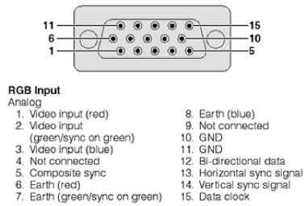
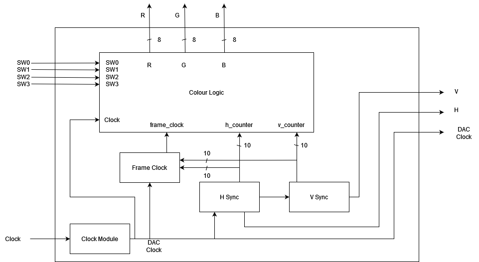
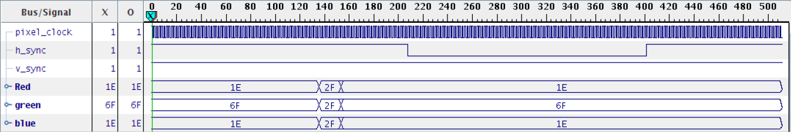
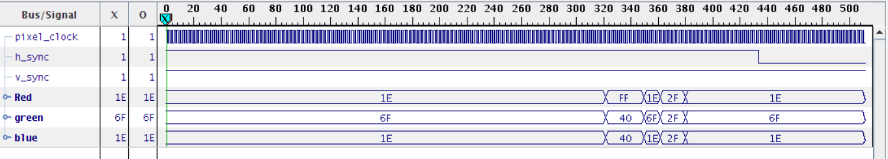
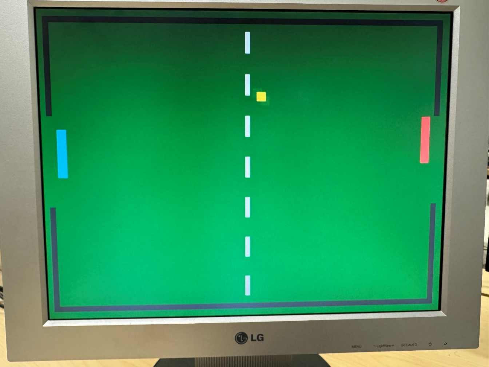
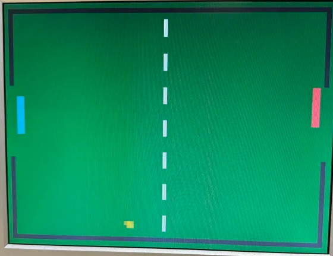

# Pong in VHDL on Spartan3E FPGA Board
If you are taking this course please do **NOT** copy my work, rather use it as a reference

## Abstract

The goal of this project was to have a deeper understanding of the video-output subsystem and the Video Graphic Adaptor (VGA) and interfacing the VGA output with a FPGA board. This design project required understanding the VGA behavior at the to implement a simple video game processor. This was achieved by utilizing VHDL programming on the Xilinx Spartan-3E FPGA board using the Xilinx IDE. Before the development started, the block diagram design was sketched by hand then finalized using a block diagram design software. Then, all the blocks were implemented in a single file defined as one or two behaviors depending on the complexity of the module. The design was heavily based on the block diagram and implementing the block diagram into VHDL code. The required logic for collisions and paddle movement was implemented to achieve a fully functional pong game. The Code includes a lot of optimized code to ensure the best performance possible, while still having the least number of code lines possible. The functionality of the video game alongside analyzing timing simulations and ChipScope logic analyzer diagrams proved the implementation of the hardware and code were successful

## Introduction

### Objective

This design project had several objectives. They were:

-   To have a deeper understanding of the video-output subsystem and the Video Graphic Adaptor (VGA) and interfacing the VGA output with a FPGA board.
-   To gain hands-on experience designing and implementing real-time signal generators directly on an FPGA using custom logic circuits.
-   To get hands-on experience interfacing the FPGA custom logic circuits with external output Devices (VGA monitor).

### Approach

Before starting the development process of the Simple Video-Game Processor (SVGP), its schematic and block diagrams were drawn; then the development process began. Implementing the design in VHDL and the code for the SVGP was implemented in a single file, where each block in the block diagram was defined as one or two behaviors depending on the complexity of the block/module. A lot of trial-and-error testing was used to have a proper looking screen, especially the dashed line down the middle and the borders of the screen. Alongside of manually testing the results and using the simulation timing diagrams and the ChipScope logic analyzer to analyze the timing diagrams of the code.

### Results

A video of the project working properly is provided alongside this report. The timing simulations and ChipScope logic analyzer diagrams are provided in the Timing Diagrams section.

### Theory

VGA, or Video Graphics Array, is a standard connection used to link display devices like monitors or projectors to a video source, such as a desktop computer. This analog video interface was widely used for transmitting video signals and remains relevant in some personal and commercial applications, though it's quickly being phased out by newer technologies.

VGA was first introduced by IBM in 1987 as part of their PS/2 line of computers. The connector itself is a 15-pin, three-row D-subminiature design known as DE-15, which became a recognizable standard for video connections.



**Figure 1.0:** VGA Pin Assignments and their labels.

## System Specifications

| Inputs | Outputs |
|--------|---------|
| SW0    | R (7-0) |
| SW1    | G (7-0) |
| SW2    | B (7-0) |
| SW3    | V_sync  |
| Clock  | H_sync  |

## 

## Device Description

### VGA Specifications

The screen resolution is 640x480. This means that the active area of the screen is 640 horizontal pixels and 480 vertical pixels, each pixel would need 1 clock cycle to change its color, however this does not mean that 640 is the upper limit for the number of cycles needed to color 1 line. There is more variables to take into account such as Front Porch, Sync Pulse and Back Porch. Adding the number of clock cycles each variable requires, in addition to the number of pixels in each line (which is equal to the number of clock cycles for 1 line), would result in the total number of clock cycles to fully color a line.

| **Parameter**                            | **Clock Cycle Horizontally** | **Clock Cycle Vertically** |
|------------------------------------------|------------------------------|----------------------------|
| Front Porch                              | 16                           | 10                         |
| Sync Pulse                               | 96                           | 2                          |
| Back Porch                               | 48                           | 33                         |
| Active Image Area                        | 640                          | 480                        |
| **Complete Line (Sum of above columns)** | 800                          | 525                        |

**Table 1.0:** Horizontal and Vertical Parameters

The number of cycles for a complete line is used to determine the when to start displaying the next line.

### Block Diagrams

 **Figure 2.0:** Block Diagram of the SVGP

Note: The variable names in the block diagrams are different than the variable names in the code; the variable names in the code were renamed to be much more descriptive, to have a high quality code.

**Clock Module**

The purpose of the Clock Module is to adjust the board clock from its original frequency of 50MHz, using a frequency divider latch to reduce it to 25MHz. The module takes in the board clock as its only input, and its sole output is the DAC_Clock signal.
```VHDL
-- Pixel clock module

-- Pixel clock generation (25 MHz using a 50 MHz system clock)

PROCESS (clock)

BEGIN

-- Pixel clock is generated

-- Pixel clock's value changes on every rising edge of the main clock

-- This means the pixel clock has half the frequency of the main clock

IF rising_edge(clock) THEN

pixel_clock <= NOT(pixel_clock);

END IF;

END PROCESS;

-- Assigning the pixel clock to the DAC_clock output

DAC_clock <= pixel_clock;
```

**H_Sync Module**

The main function of this module is to track the horizontal pixel count for each row based on the VGA screen specifications. It is designed to follow the timing requirements outlined in the lab manual, particularly the horizontal timing parameters detailed in Table 1 of the VGA specification section.

This module uses the DAC_clock as its synchronization signal, incrementing a counter on each rising edge. Its outputs include the h_counter signal, the h_sync signal (which is sent directly to the screen), and a clock signal that serves as input for the v_sync module.

**V_Sync Module**

The role of this module is to maintain the vertical count, indicating which row is currently being drawn on the screen. Unlike the h_Sync module, it doesn’t rely on the DAC_clock for synchronization. Instead, it is incremented when the the value of H_Sync reaches 799. The outputs of this module include the v_counter signal and the V_sync signal, which is sent to the screen.
```VHDL
-- H-sync and V-sync counter setup for VGA

PROCESS (pixel_clock, horizontal_counter, vertical_counter)

BEGIN

IF rising_edge(pixel_clock)THEN

-- horizontal counts from 0 to 799

horizontal_counter <= horizontal_counter + 1;

-- if the horizontal_counter is 799 then increment the vertical counter

-- and reset the horizontal counter to 0 to start a new line

IF (horizontal_counter = 799) THEN

vertical_counter <= vertical_counter + 1;

horizontal_counter <= 0;

END IF;

-- vertical counts from 0 to 524

-- if vertical counter is 524 then reset it to 0

IF (vertical_counter = 524) THEN

vertical_counter <= 0;

END IF;

END IF;

END PROCESS;

-- H-sync and V-sync signal intitilization

-- they are low only during the sync pulse

h_sync <= '0' WHEN horizontal_counter <= 96 ELSE '1';

v_sync <= '0' WHEN vertical_counter <= 2 ELSE '1';
```

**Color Logic**

The Color Logic Module is the core computational part of the design. It handles both the game and drawing logic.

This module takes in the h_count and v_count signals, which provide screen coordinates (including the porch and sync times). The DAC_clock signal synchronizes the RGB outputs, and the frame_clock pulse triggers the game logic updates.

It also uses the SW0 and SW2 signals to move the blue and red paddles respectively, and the SW1 and SW3 signals to enable/disable the movement of the blue and red paddles respectively.

A lot of conditional statements are used in this module to determine what to draw and where on the screen.

Color Logic Subcomponent:

A series of conditionals statements defines the boundaries of every object on the screen, any pixel that isn't an object on the screen is set to display green. When outside the active region, do not display color.

Note: code is provided in appendix under color logic

Game Logic Subcomponent:

- Paddles: The logic checks the direction of the switch. The paddle moves depending on the switch direction. If the paddle moves to either top or bottom border it stops moving

- Ball: The logic updates the ball's x and y coordinates based on the x_dir and y_dir values, which change direction when the ball collides with a paddle or wall.

- The ball’s collision logic checks if it has hit any border or paddle, then changes the direction of the ball to the opposite way.

- If the ball passes either paddle, it is considered a goal, its position resets to the center of the screen, and the direction is flipped, meaning loser gets the ball.

Note: code is provided in appendix under game logic

## 

## Results

### Timing Diagrams

The input and output of the SVGP can in seen in the following figures.



**Figure 3.0:** Timing Diagram 1

This timing diagram shows the horizontal_sync resetting, after reaching the end of a line, it also shows the different colors being displayed to the screen, \#1E6F1E (green) and \#2F2F2F (black), meaning this diagram was captured when the screen was displaying the border.



**Figure 4.0:** Timing Diagram 2

This timing diagram shows the horizontal_sync resetting, after reaching the end of a line, it also shows the different colors being displayed to the screen, \#1E6F1E (green), \#FF4040 (red) and \#2F2F2F (black), meaning this diagram was captured when the screen was displaying the instance a player has scored a goal.

The v_sync signal resetting was hard to capture in the timing diagram since it happens a lot less frequently than h_sync.

These timing diagrams are consistent with what appears on screen, and they prove the SVGP is working properly and as expected.

### Screen Shots



**Figure 5.0:**  Screen capture of the ball moving towards the red player after colliding with top border



**Figure 6.0:**  Screen capture of the ball moving towards the blue player after colliding with bottom border

## Conclusion

In this project, a Simple Video Game Processor (SVGP) was implemented using Video Graphic Adapter (VGA) and VHDL program implemented on Spartan-3E FPGA Board and Xilinx IDE. The timing simulations displayed in figure x.0 demonstrate the synchronization between horizontal and vertical synchronization signals. Throughout the design project several challenges were encountered with many attributed to human error and wrong use of data types. However, during debugging and research the problems were fixed, resulting in a high performance and highly optimized pong game implemented on the FPGA. The timing diagrams in Figures 3.0 and 4.0 confirmed the correct VGA signal generation, with proper sync timing and 640x480 resolution. The 25MHz pixel clock was successfully derived from the 50MHz system clock, and the screen captures in Figures 5.0 and 6.0 showed clear graphics with accurate collision detection. The color logic module generated RGB signals for game elements, synchronized with the frame clock.

Several challenges, including data type mismatches, timing synchronization, and collision detection, were resolved through debugging and research, resulting in an optimized design. The project met its objectives and demonstrated effective use of digital design principles for future FPGA video processing applications.

## Appendix

### Main Code
```VHDL
LIBRARY IEEE;

USE IEEE.STD_LOGIC_1164.ALL;

USE IEEE.STD_LOGIC_ARITH.ALL;

USE IEEE.STD_LOGIC_UNSIGNED.ALL;

USE IEEE.NUMERIC_STD.ALL;

ENTITY pong_game IS

PORT (

-- Clock Signal to synchronize all modules

clock : IN STD_LOGIC;

-- VGA sync and DAC clock outputs

h_sync : OUT STD_LOGIC;

v_sync : OUT STD_LOGIC;

DAC_clock : OUT STD_LOGIC;

-- RGB colouroutput for VGA display

blue_out : OUT STD_LOGIC_VECTOR (7 DOWNTO 0);

green_out : OUT STD_LOGIC_VECTOR (7 DOWNTO 0);

red_out : OUT STD_LOGIC_VECTOR (7 DOWNTO 0);

-- Paddle control switches

SW0 : IN STD_LOGIC; -- switch 0 moves blue paddle

SW1 : IN STD_LOGIC; -- switch 1 enable blue paddle to move

SW2 : IN STD_LOGIC; -- switch 2 moves red paddle

SW3 : IN STD_LOGIC -- switch 3 enable red paddle to move

);

END pong_game;

ARCHITECTURE Behavioral OF pong_game IS

---------------------------------------------------------

-- ChipScope components and signals.

---------------------------------------------------------

COMPONENT icon

PORT (

CONTROL0 : INOUT STD_LOGIC_VECTOR(35 DOWNTO 0)

);

END COMPONENT;

COMPONENT ila

PORT (

CONTROL : INOUT STD_LOGIC_VECTOR(35 DOWNTO 0);

CLK : IN STD_LOGIC;

DATA : IN STD_LOGIC_VECTOR(31 DOWNTO 0);

TRIG0 : IN STD_LOGIC_VECTOR(7 DOWNTO 0)

);

END COMPONENT;

SIGNAL control0 : STD_LOGIC_VECTOR(35 DOWNTO 0);

SIGNAL ila_data : STD_LOGIC_VECTOR(31 DOWNTO 0);

SIGNAL trig0 : STD_LOGIC_VECTOR(7 DOWNTO 0);

---------------------------------------------------------

-- System components and signals.

---------------------------------------------------------

-- Horizontal sync counter (H-counter for VGA)

SIGNAL horizontal_counter : INTEGER RANGE 0 TO 799;

-- Vertical sync counter (V-counter for VGA)

SIGNAL vertical_counter : INTEGER RANGE 0 TO 524;

-- Pixel Clock Counter

SIGNAL pixel_clock : std_logic;

-- Refresh Rate Counter

SIGNAL refresh_clock : std_logic;

SIGNAL refresh_counter : INTEGER := 0;

-- RGB output signals for the VGA display

SIGNAL red_colour: std_logic_vector(7 DOWNTO 0);

SIGNAL green_colour : std_logic_vector(7 DOWNTO 0);

SIGNAL blue_colour : std_logic_vector(7 DOWNTO 0);

-- Top-left boundary coordinates

SIGNAL top_left_x1 : INTEGER := 10;

SIGNAL top_left_x2 : INTEGER := 20;

SIGNAL top_left_y1 : INTEGER := 10;

SIGNAL top_left_y2 : INTEGER := 160;

-- Top horizontal boundary coordinates

SIGNAL top_horizontal_x1 : INTEGER := 10;

SIGNAL top_horizontal_x2 : INTEGER := 630;

SIGNAL top_horizontal_y1 : INTEGER := 10;

SIGNAL top_horizontal_y2 : INTEGER := 20;

-- Top-right boundary coordinate

SIGNAL top_right_x1 : INTEGER := 620;

SIGNAL top_right_x2 : INTEGER := 630;

SIGNAL top_right_y1 : INTEGER := 10;

SIGNAL top_right_y2 : INTEGER := 160;

-- Bottom-left boundary coordinates

SIGNAL bottom_left_x1 : INTEGER := 10;

SIGNAL bottom_left_x2 : INTEGER := 20;

SIGNAL bottom_left_y1 : INTEGER := 300;

SIGNAL bottom_left_y2 : INTEGER := 470;

-- Bottom horizontal boundary coordinates

SIGNAL bottom_horizontal_x1 : INTEGER := 10;

SIGNAL bottom_horizontal_x2 : INTEGER := 630;

SIGNAL bottom_horizontal_y1 : INTEGER := 460;

SIGNAL bottom_horizontal_y2 : INTEGER := 470;

-- Bottom-right boundary coordinates

SIGNAL bottom_right_x1 : INTEGER := 620;

SIGNAL bottom_right_x2 : INTEGER := 630;

SIGNAL bottom_right_y1 : INTEGER := 300;

SIGNAL bottom_right_y2 : INTEGER := 470;

-- Mid-field center line coordinates

SIGNAL middle_line_x1 : INTEGER := 316;

SIGNAL middle_line_x2 : INTEGER := 324;

SIGNAL middle_line_y1 : INTEGER := 30;

SIGNAL middle_line_y2 : INTEGER := 450;

-- Red paddle dimensions

SIGNAL red_paddle_x1 : INTEGER := 600;

SIGNAL red_paddle_x2 : INTEGER := 615;

SIGNAL red_paddle_y1 : INTEGER := 200;

SIGNAL red_paddle_y2 : INTEGER := 275;

-- Blue paddle dimensions

SIGNAL blue_paddle_x1 : INTEGER := 25;

SIGNAL blue_paddle_x2 : INTEGER := 40;

SIGNAL blue_paddle_y1 : INTEGER := 200;

SIGNAL blue_paddle_y2 : INTEGER := 275;

-- Ball dimensions

SIGNAL ball_x1 : INTEGER := 310;

SIGNAL ball_x2 : INTEGER := 325;

SIGNAL ball_y1 : INTEGER := 230;

SIGNAL ball_y2 : INTEGER := 245;

-- Goal line coordinates for red and blue paddles

SIGNAL red_goal_x : INTEGER := 625;

SIGNAL blue_goal_x : INTEGER := 15;

--Flags for score detection and reset

SIGNAL score_flag : std_logic;

SIGNAL reset_flag : std_logic;

-- Ball direction flags (X and Y direction)

SIGNAL ball_x_direction : std_logic;

SIGNAL ball_y_direction : std_logic;

SIGNAL ball_x_direction_int: INTEGER;

SIGNAL ball_y_direction_int: INTEGER;

BEGIN

---------------------------------------------------------

-- ChipScope components.

---------------------------------------------------------

sys_icon : icon

PORT MAP (

CONTROL0 => control0

);

sys_ila : ila

PORT MAP (

CONTROL => control0,

CLK => clock,

DATA => ila_data,

TRIG0 => trig0

);

---------------------------------------------------------

-- System components.

---------------------------------------------------------

-- Pixel clock module

-- Pixel clock generation (25 MHz using a 50 MHz system clock)

PROCESS (clock)

BEGIN

-- Pixel clock is generated

-- Pixel clock's value changes on every rising edge of the main clock

-- This means the pixel clock has half the frequency of the main clock

IF rising_edge(clock) THEN

pixel_clock <= NOT(pixel_clock);

END IF;

END PROCESS;

-- Assigning the pixel clock to the DAC_clock output

DAC_clock <= pixel_clock;

-- H-sync and V-sync counter setup for VGA

PROCESS (pixel_clock, horizontal_counter, vertical_counter)

BEGIN

IF rising_edge(pixel_clock)THEN

-- horizontal counts from 0 to 799

horizontal_counter <= horizontal_counter + 1;

-- if the horizontal_counter is 799 then increment the vertical counter

-- and reset the horizontal counter to 0 to start a new line

IF (horizontal_counter = 799) THEN

vertical_counter <= vertical_counter + 1;

horizontal_counter <= 0;

END IF;

-- vertical counts from 0 to 524

-- if vertical counter is 524 then reset it to 0

IF (vertical_counter = 524) THEN

vertical_counter <= 0;

END IF;

END IF;

END PROCESS;

-- H-sync and V-sync signal intitilization

-- they are low only during the sync pulse

h_sync <= '0' WHEN horizontal_counter <= 96 ELSE '1';

v_sync <= '0' WHEN vertical_counter <= 2 ELSE '1';

-- Display colouroutput when in the active region

PROCESS BEGIN

IF (horizontal_counter >= 143 AND horizontal_counter <= 783 AND vertical_counter >= 34 AND vertical_counter <= 514) THEN

red_out <= red_colour;

green_out <= green_colour;

blue_out <= blue_colour;

ELSE

red_out <= (OTHERS => '0');

green_out <= (OTHERS => '0');

blue_out <= (OTHERS => '0');

END IF;

END PROCESS;

-- Refresh rate clock generation for game movement

PROCESS (pixel_clock) BEGIN

-- Refresh clock module

IF rising_edge(pixel_clock) THEN

-- Check if the refresh counter has reached the threshold of 416667 cycles.

-- This threshold is calculated to create a clock that toggles around 60 Hz given the 25 MHz pixel clock.

-- (25,000,000 Hz / 416,667 is approximately 60 Hz)

IF (refresh_counter >= 416667) THEN

-- Refresh clock's value changes on every rising edge of the Pixle clock, This is used to update elements

refresh_clock <= NOT(refresh_clock);

-- Reset the counter

refresh_counter <= 0;

ELSE

-- Increment the refresh counter

refresh_counter <= refresh_counter + 1;

END IF;

END IF;

END PROCESS;

--Ball movement and collision detection

PROCESS (refresh_clock) BEGIN

IF rising_edge(refresh_clock) THEN

--Wall and paddle collision detection

IF --Ball hits top-left boundary

(ball_x1 <= top_left_x2 + 10 AND (ball_y1 >= top_horizontal_y2 AND ball_y2 <= top_right_y2 + 2))

OR

--Ball hits bottom-left boundary

(ball_x1 <= bottom_left_x2 + 10 AND (ball_y1 >= bottom_right_y1 - 2 AND ball_y2 <= bottom_right_y2))

OR

-- Blue Paddle Collision

(ball_x2 >= blue_paddle_x1 AND ball_x1 <= blue_paddle_x2 AND -- X-axis overlap with blue paddle

ball_y2 >= blue_paddle_y1 AND ball_y1 <= blue_paddle_y2) -- Y-axis overlap with blue paddle

THEN

--Ball has hit a boundry on the left, send ball to positive x direction

ball_x_direction <= '1';

ELSIF

--Ball hits top-right boundary

(ball_x2 >= top_right_x1 - 7 AND (ball_y2 >= top_horizontal_y2 AND ball_y1 <= top_right_y2))

OR

--Ball hits bottom-right boundary

(ball_x2 >= bottom_right_x1 - 7 AND (ball_y2 >= bottom_left_y1 AND ball_y1 <= bottom_right_y2))

OR

-- Red Paddle Collision

(ball_x2 >= red_paddle_x1 AND ball_x1 <= red_paddle_x2 AND -- X-axis overlap with red paddle

ball_y2 >= red_paddle_y1 AND ball_y1 <= red_paddle_y2) -- Y-axis overlap with red paddle

THEN

--Ball has hit a boundry on the right, send ball to negative x direction

ball_x_direction <= '0';

END IF;

--Ball has hit top boundary; send ball in negative y direction

IF (ball_y1 <= top_horizontal_y2 + 7) THEN

ball_y_direction <= '0';

--Ball has hit bottom boundary; send ball in positive y direction

ELSIF (ball_y2 >= bottom_horizontal_y1 - 7) THEN

ball_y_direction <= '1';

END IF;

-- These two statements are seperated to allow the ball's colourto change to red in the next cycles

-- Goal collision detection

IF (ball_x1 < blue_goal_x --Ball reaches left goal line; red paddle scores

OR ball_x2 > red_goal_x --Ball reaches right goal line; blue paddle scores

)

THEN

score_flag <= '1';

ELSE --Otherwise, if none of the conditions have been met, there is no scoring

score_flag <= '0';

END IF;

IF (ball_x1 <= 5 or ball_x2 >= 635) THEN

--Ball has reached end of screen (left, right); reset_flag ball location

ball_x1 <= 310;

ball_x2 <= 325;

ball_y1 <= 230;

ball_y2 <= 245;

ball_y_direction <= '1';

-- flip direction

ball_x_direction <= NOT(ball_x_direction);

ELSE

--Ball movement

-- https://stackoverflow.com/questions/34039510/std-logic-to-integer-conversion

ball_x_direction_int <= conv_integer(ball_x_direction);

ball_y_direction_int <= conv_integer(ball_y_direction);

--Move ball in x direction

-- This will add 6 if the ball_x_direction_int is '1'

-- and subtact 6 if the ball_x_direction_int is '0'

ball_x1 <= ball_x1 + 6 * ((ball_x_direction_int * 2) - 1);

ball_x2 <= ball_x2 + 6 * ((ball_x_direction_int * 2) - 1);

--Move ball in positive y direction

-- This will add 6 if the ball_x_direction_int is '0'

-- and subtact 6 if the ball_x_direction_int is '1'

ball_y1 <= ball_y1 - 6 * ((ball_y_direction_int * 2) - 1);

ball_y2 <= ball_y2 - 6 * ((ball_y_direction_int * 2) - 1);

END IF;

END IF;

END PROCESS;

--Paddle movement and collision detection

PROCESS (refresh_clock)

BEGIN

IF rising_edge(refresh_clock) THEN

-- Move the blue paddle based on the state of SW0 (up or down)

IF (SW0 = '1' AND SW1 = '1' AND blue_paddle_y1 > top_horizontal_y2) THEN

-- Move blue paddle up if within the top boundary

blue_paddle_y1 <= blue_paddle_y1 - 10;

blue_paddle_y2 <= blue_paddle_y2 - 10;

ELSIF (SW0 = '0' AND SW1 = '1' AND blue_paddle_y2 < bottom_horizontal_y1) THEN

-- Move blue paddle down if within the bottom boundary

blue_paddle_y1 <= blue_paddle_y1 + 10;

blue_paddle_y2 <= blue_paddle_y2 + 10;

END IF;

-- Move the red paddle based on the state of SW1 (up or down)

IF (SW2 = '1' AND SW3 = '1' AND red_paddle_y1 > top_horizontal_y2) THEN

--Move red paddle up if within the top boundary

red_paddle_y1 <= red_paddle_y1 - 10;

red_paddle_y2 <= red_paddle_y2 - 10;

ELSIF (SW2 = '0' AND SW3 = '1' AND red_paddle_y2 < bottom_horizontal_y1) THEN

-- Move red paddle down if within the bottom boundary

red_paddle_y1 <= red_paddle_y1 + 10;

red_paddle_y2 <= red_paddle_y2 + 10;

END IF;

END IF;

END PROCESS;

--Display VGA Controller

PROCESS (horizontal_counter, vertical_counter)

VARIABLE x : INTEGER RANGE 0 TO 639;

VARIABLE y : INTEGER RANGE 0 TO 479;

BEGIN

x := horizontal_counter - 143;

y := vertical_counter - 34;

--Every pixel that isn't an object on the screen is set to display green

--colour: #1e6f1e

red_colour<= "00011110";

green_colour <= "01101111";

blue_colour <= "00011110";

--Displaying the ball

IF (x > ball_x1 AND x < ball_x2 AND y > ball_y1 AND y < ball_y2) THEN

--Changing the ball colour to red when either side has scored

IF (score_flag = '1') THEN

-- colour: #dc143c

red_colour<= "11011100";

green_colour <= "00010100";

blue_colour <= "00111100";

ELSE

-- colour: #ffd700

red_colour<= "11111111";

green_colour <= "11010111";

blue_colour <= "00000000";

END IF;

--Displaying the boundaries of the field

ELSIF

-- TOP Left Vertical Bar

(x > top_left_x1 AND x < top_left_x2 AND y > top_left_y1 AND y < top_left_y2)

OR

-- TOP Horizontal Bar

(x > top_horizontal_x1 AND x < top_horizontal_x2 AND y > top_horizontal_y1 AND y < top_horizontal_y2)

OR

-- TOP Right Vertical Bar

(x > top_right_x1 AND x < top_right_x2 AND y > top_right_y1 AND y < top_right_y2)

OR

-- Bottom Left Vertical Bar

(x > bottom_left_x1 AND x < bottom_left_x2 AND y > bottom_left_y1 AND y < bottom_left_y2)

OR

-- TOP Vertical Bar

(x > bottom_horizontal_x1 AND x < bottom_horizontal_x2 AND y > bottom_horizontal_y1 AND y < bottom_horizontal_y2)

OR

-- Bottom Right Vertical Bar

(x > bottom_right_x1 AND x < bottom_right_x2 AND y > bottom_right_y1 AND y < bottom_right_y2)

THEN

-- colour: #2F2F2F

red_colour<= "00101111";

green_colour <= "00101111";

blue_colour <= "00101111";

-- Middle Line

ELSIF (x > middle_line_x1 AND x < middle_line_x2 AND y > middle_line_y1 AND y < middle_line_y2) THEN

-- This if statement is used to make the line dashed

IF (y MOD 64 > 31) THEN

-- colour: #F8F8FF

red_colour<= "11111000";

green_colour <= "11111000";

blue_colour <= "11111111";

END IF;

--Displaying the paddles

ELSIF (x > red_paddle_x1 AND x < red_paddle_x2 AND y > red_paddle_y1 AND y < red_paddle_y2) THEN

--Red paddle

-- colour: #ff4040

red_colour<= "11111111";

green_colour <= "01000000";

blue_colour <= "01000000";

ELSIF (x > blue_paddle_x1 AND x < blue_paddle_x2 AND y > blue_paddle_y1 AND y < blue_paddle_y2) THEN

--Blue paddle

-- colour: #1e90ff

red_colour<= "00011110";

green_colour <= "10010000";

blue_colour <= "11111111";

END IF;

END PROCESS;

---------------------------------------------------------

-- ChipScope Signals.

---------------------------------------------------------

ila_data(0) <= '0';

ila_data(1) <= pixel_clock;

ila_data(2) <= '0' WHEN horizontal_counter <= 96 ELSE '1';

ila_data(3) <= '0' WHEN vertical_counter <= 2 ELSE '1';

ila_data(14 DOWNTO 7) <= red_colour;

ila_data(22 DOWNTO 15) <= green_colour;

ila_data(30 DOWNTO 23) <= blue_colour;

ila_data(31) <= '0';

END behavioral;
```

### Pin Configurations
```VHDL
## 50 MHz input clock.

NET "clock" LOC = "c9";

## Synchronization signals.

NET "h_sync" LOC = "c5";

NET "v_sync" LOC = "d5";

## Pixel clock for the video DAC.

NET "DAC_clock" LOC = "a4";

## Blue channel pins.

NET "blue_out<7>" LOC = "b16";

NET "blue_out<6>" LOC = "a16";

NET "blue_out<5>" LOC = "d14";

NET "blue_out<4>" LOC = "c14";

NET "blue_out<3>" LOC = "b14";

NET "blue_out<2>" LOC = "a14";

NET "blue_out<1>" LOC = "b13";

NET "blue_out<0>" LOC = "a13";

## Green channel pins.

NET "green_out<0>" LOC = "f9";

NET "green_out<1>" LOC = "e9";

NET "green_out<2>" LOC = "d11";

NET "green_out<3>" LOC = "c11";

NET "green_out<4>" LOC = "f11";

NET "green_out<5>" LOC = "e11";

NET "green_out<6>" LOC = "e12";

NET "green_out<7>" LOC = "f12";

## Red channel pins.

NET "red_out<0>" LOC = "a6";

NET "red_out<1>" LOC = "b6";

NET "red_out<2>" LOC = "e7";

NET "red_out<3>" LOC = "f7";

NET "red_out<4>" LOC = "d7";

NET "red_out<5>" LOC = "c7";

NET "red_out<6>" LOC = "f8";

NET "red_out<7>" LOC = "e8";

## On-board switches.

NET "SW0" LOC = "N17";

NET "SW1" LOC = "H18";

NET "SW2" LOC = "L14";

NET "SW3" LOC = "L13";
```

### Color Logic
```VHDL
--Display VGA Controller

PROCESS (horizontal_counter, vertical_counter)

VARIABLE x : INTEGER RANGE 0 TO 639;

VARIABLE y : INTEGER RANGE 0 TO 479;

BEGIN

x := horizontal_counter - 143;

y := vertical_counter - 34;

--Every pixel that isn't an object on the screen is set to display green

--colour: #1e6f1e

red_colour<= "00011110";

green_colour <= "01101111";

blue_colour <= "00011110";

--Displaying the ball

IF (x > ball_x1 AND x < ball_x2 AND y > ball_y1 AND y < ball_y2) THEN

--Changing the ball colour to red when either side has scored

IF (score_flag = '1') THEN

-- colour: #dc143c

red_colour<= "11011100";

green_colour <= "00010100";

blue_colour <= "00111100";

ELSE

-- colour: #ffd700

red_colour<= "11111111";

green_colour <= "11010111";

blue_colour <= "00000000";

END IF;

--Displaying the boundaries of the field

ELSIF

-- TOP Left Vertical Bar

(x > top_left_x1 AND x < top_left_x2 AND y > top_left_y1 AND y < top_left_y2)

OR

-- TOP Horizontal Bar

(x > top_horizontal_x1 AND x < top_horizontal_x2 AND y > top_horizontal_y1 AND y < top_horizontal_y2)

OR

-- TOP Right Vertical Bar

(x > top_right_x1 AND x < top_right_x2 AND y > top_right_y1 AND y < top_right_y2)

OR

-- Bottom Left Vertical Bar

(x > bottom_left_x1 AND x < bottom_left_x2 AND y > bottom_left_y1 AND y < bottom_left_y2)

OR

-- TOP Vertical Bar

(x > bottom_horizontal_x1 AND x < bottom_horizontal_x2 AND y > bottom_horizontal_y1 AND y < bottom_horizontal_y2)

OR

-- Bottom Right Vertical Bar

(x > bottom_right_x1 AND x < bottom_right_x2 AND y > bottom_right_y1 AND y < bottom_right_y2)

THEN

-- colour: #2F2F2F

red_colour<= "00101111";

green_colour <= "00101111";

blue_colour <= "00101111";

-- Middle Line

ELSIF (x > middle_line_x1 AND x < middle_line_x2 AND y > middle_line_y1 AND y < middle_line_y2) THEN

-- This if statement is used to make the line dashed

IF (y MOD 64 > 31) THEN

-- colour: #F8F8FF

red_colour<= "11111000";

green_colour <= "11111000";

blue_colour <= "11111111";

END IF;

--Displaying the paddles

ELSIF (x > red_paddle_x1 AND x < red_paddle_x2 AND y > red_paddle_y1 AND y < red_paddle_y2) THEN

--Red paddle

-- colour: #ff4040

red_colour<= "11111111";

green_colour <= "01000000";

blue_colour <= "01000000";

ELSIF (x > blue_paddle_x1 AND x < blue_paddle_x2 AND y > blue_paddle_y1 AND y < blue_paddle_y2) THEN

--Blue paddle

-- colour: #1e90ff

red_colour<= "00011110";

green_colour <= "10010000";

blue_colour <= "11111111";

END IF;

END PROCESS;
```
### Game Logic
```VHDL
--Ball movement and collision detection

PROCESS (refresh_clock) BEGIN

IF rising_edge(refresh_clock) THEN

--Wall and paddle collision detection

IF --Ball hits top-left boundary

(ball_x1 <= top_left_x2 + 10 AND (ball_y1 >= top_horizontal_y2 AND ball_y2 <= top_right_y2 + 2))

OR

--Ball hits bottom-left boundary

(ball_x1 <= bottom_left_x2 + 10 AND (ball_y1 >= bottom_right_y1 - 2 AND ball_y2 <= bottom_right_y2))

OR

-- Blue Paddle Collision

(ball_x2 >= blue_paddle_x1 AND ball_x1 <= blue_paddle_x2 AND -- X-axis overlap with blue paddle

ball_y2 >= blue_paddle_y1 AND ball_y1 <= blue_paddle_y2) -- Y-axis overlap with blue paddle

THEN

--Ball has hit a boundry on the left, send ball to positive x direction

ball_x_direction <= '1';

ELSIF

--Ball hits top-right boundary

(ball_x2 >= top_right_x1 - 7 AND (ball_y2 >= top_horizontal_y2 AND ball_y1 <= top_right_y2))

OR

--Ball hits bottom-right boundary

(ball_x2 >= bottom_right_x1 - 7 AND (ball_y2 >= bottom_left_y1 AND ball_y1 <= bottom_right_y2))

OR

-- Red Paddle Collision

(ball_x2 >= red_paddle_x1 AND ball_x1 <= red_paddle_x2 AND -- X-axis overlap with red paddle

ball_y2 >= red_paddle_y1 AND ball_y1 <= red_paddle_y2) -- Y-axis overlap with red paddle

THEN

--Ball has hit a boundry on the right, send ball to negative x direction

ball_x_direction <= '0';

END IF;

--Ball has hit top boundary; send ball in negative y direction

IF (ball_y1 <= top_horizontal_y2 + 7) THEN

ball_y_direction <= '0';

--Ball has hit bottom boundary; send ball in positive y direction

ELSIF (ball_y2 >= bottom_horizontal_y1 - 7) THEN

ball_y_direction <= '1';

END IF;

-- These two statements are seperated to allow the ball's colourto change to red in the next cycles

-- Goal collision detection

IF (ball_x1 < blue_goal_x --Ball reaches left goal line; red paddle scores

OR ball_x2 > red_goal_x --Ball reaches right goal line; blue paddle scores

)

THEN

score_flag <= '1';

ELSE --Otherwise, if none of the conditions have been met, there is no scoring

score_flag <= '0';

END IF;

IF (ball_x1 <= 5 or ball_x2 >= 635) THEN

--Ball has reached end of screen (left, right); reset_flag ball location

ball_x1 <= 310;

ball_x2 <= 325;

ball_y1 <= 230;

ball_y2 <= 245;

ball_y_direction <= '1';

-- flip direction

ball_x_direction <= NOT(ball_x_direction);

ELSE

--Ball movement

-- https://stackoverflow.com/questions/34039510/std-logic-to-integer-conversion

ball_x_direction_int <= conv_integer(ball_x_direction);

ball_y_direction_int <= conv_integer(ball_y_direction);

--Move ball in x direction

-- This will add 6 if the ball_x_direction_int is '1'

-- and subtact 6 if the ball_x_direction_int is '0'

ball_x1 <= ball_x1 + 6 * ((ball_x_direction_int * 2) - 1);

ball_x2 <= ball_x2 + 6 * ((ball_x_direction_int * 2) - 1);

--Move ball in positive y direction

-- This will add 6 if the ball_x_direction_int is '0'

-- and subtact 6 if the ball_x_direction_int is '1'

ball_y1 <= ball_y1 - 6 * ((ball_y_direction_int * 2) - 1);

ball_y2 <= ball_y2 - 6 * ((ball_y_direction_int * 2) - 1);

END IF;

END IF;

END PROCESS;

--Paddle movement and collision detection

PROCESS (refresh_clock)

BEGIN

IF rising_edge(refresh_clock) THEN

-- Move the blue paddle based on the state of SW0 (up or down)

IF (SW0 = '1' AND SW1 = '1' AND blue_paddle_y1 > top_horizontal_y2) THEN

-- Move blue paddle up if within the top boundary

blue_paddle_y1 <= blue_paddle_y1 - 10;

blue_paddle_y2 <= blue_paddle_y2 - 10;

ELSIF (SW0 = '0' AND SW1 = '1' AND blue_paddle_y2 < bottom_horizontal_y1) THEN

-- Move blue paddle down if within the bottom boundary

blue_paddle_y1 <= blue_paddle_y1 + 10;

blue_paddle_y2 <= blue_paddle_y2 + 10;

END IF;

-- Move the red paddle based on the state of SW1 (up or down)

IF (SW2 = '1' AND SW3 = '1' AND red_paddle_y1 > top_horizontal_y2) THEN

--Move red paddle up if within the top boundary

red_paddle_y1 <= red_paddle_y1 - 10;

red_paddle_y2 <= red_paddle_y2 - 10;

ELSIF (SW2 = '0' AND SW3 = '1' AND red_paddle_y2 < bottom_horizontal_y1) THEN

-- Move red paddle down if within the bottom boundary

red_paddle_y1 <= red_paddle_y1 + 10;

red_paddle_y2 <= red_paddle_y2 + 10;

END IF;

END IF;

END PROCESS;
```